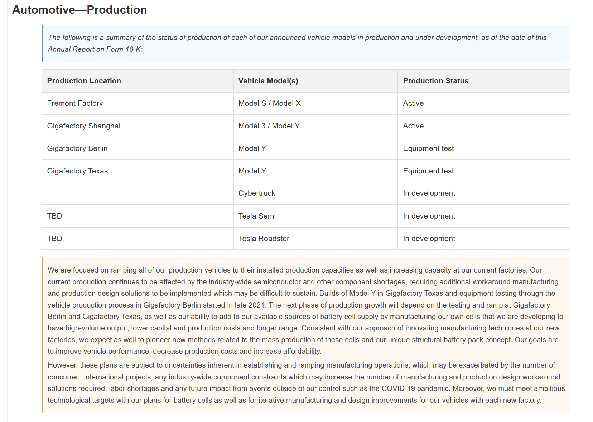
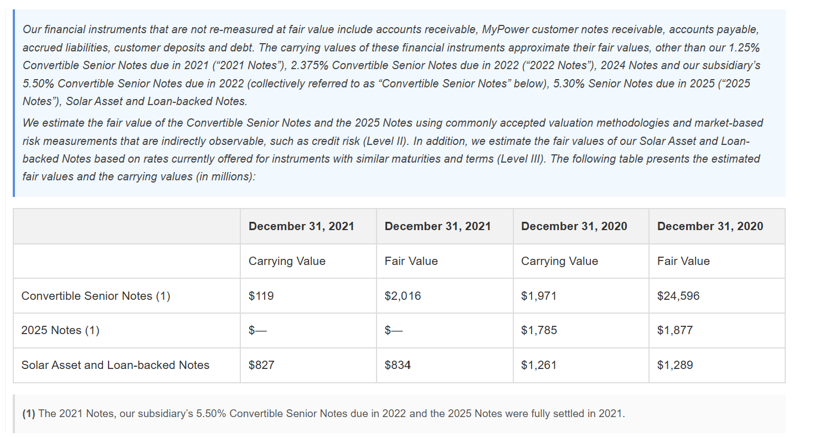

# doc2dict

Convert HTML, XML, and PDFs into dictionaries.

<!-- * [Documentation](https://john-friedman.github.io/doc2dict/) -->

Note that `doc2dict` is in an early stage. The goal is to create a fast, generalized, algorithmic parser that can be easily tweaked depending on the document.

`doc2dict` supports the [datamule](https://github.com/john-friedman/datamule-python) project.

> Update 1/11/26: Made rules much more modular. Performance will be worse. Will fix performance later. Future target performance is ~10k pages / second on a decent laptop single threaded (html).

## Parsers

1. HTML Parser
2. PDF Parser - very early stage, currently only supports some pdf types.
3. XML Parser - please use Martin Blech's excellent xmltodict. doc2dict's xml2dict is currently a mess.

## Installation

```bash
pip install doc2dict
```

## HTML

### Examples

Parsed HTML in Dictionary Form:
[example](example_output/html/dict.json)

Dictionary Form converted to HTML for easy visualiztion:
[example](example_output/html/document_visualization.html)

Table with preamble and postamble


Table with footnotes and preamble


### Quickstart

```python
from doc2dict import html2dict, visualize_dict

# Load your html file
with open('apple_10k_2024.html','r') as f:
    content = f.read()

# Parse 
dct = html2dict(content,mapping_dict=None)

# Visualize Parsing
visualize_dict(dct)
```

### Mapping Dicts

Mapping dictionaries are rules that you pass into the parser to tweak its functionality. 

The below mapping dict tells the parser that "item" header should appear in the nesting of "part" headers. Also there are a bunch of other rules that should be kept by default. You may want to tweak Footnote regex.

```python
tenk_mapping_dict = {
    "levels": {0: [
        {"name": "part", "regex": r'^part\s*([ivx]+)$'},
        {"name": "signatures", "regex": r'^signatures?\.*$'}
    ],
    1: [
        {"name": "item", "regex": r'^item\s*(\d+)\.?([a-z])?(?![a-z])'}
    ]},
    "instructions": {
        "processing": {},
        "postprocessing": {}
    },
    "dct": {
        "processing": {
            "table": {
                "detect_fake_tables": True,
                "strip_cell_text": True
            }
        },
        "postprocessing": {
            "table": {
                "bool" : [
                    "validate_structure",
                    "merge_formatting_chars",
                    "convert_images_to_text",
                    "remove_empty_rows",
                    "remove_empty_columns",
                    "remove_subset_rows_bottom_to_top",
                    "remove_subset_rows_top_to_bottom",
                    "remove_subset_columns_left_to_right",
                    "remove_subset_columns_right_to_left",
                    "simplify_cells",
                    "disallow_single_row_tables"
                ],
                "footnotes": {
                    "regex": "^(\\*|\\(\\d+\\)|\\d+|†+)"
                },
                "preamble" : {
                    "lines" : 3
                },
                "postamble" : {
                    "lines" : 3
                }

            }
        }
    }
}
```

### Debugging

```python
from doc2dict import *
from selectolax.parser import HTMLParser

# Load your html file
with open('apple_10k_2024.htm','r') as f:
    content = f.read()


body = HTMLParser(content).body

# convert html to a series of instructions
instructions = convert_html_to_instructions(body)

# visualize the conversion
visualize_instructions(instructions)

# convert instructions to dictionary
dct = html2dict(content,mapping_dict=tenk_mapping_dict)

# visualize dictionary
visualize_dict(dct)
```

### Benchmarks 

Based on my personal (potato) laptop:
* About 500 pages per second single threaded.
* Parses the 57 page Apple 10-K in 160 milliseconds.

## PDF

The pdf parser is in a very early stage. It does not always handle encoding issues and the resulting hierarchies can be quite odd.

I've released this because it may be useful to you, and as a proof of concept that fast pdf to dictionary parsing is possible. I plan to develop this further when presented with an interesting use case.

### Quickstart

```python
from doc2dict import pdf2dict, visualize_dict

# Load your html file
with open('apple_10k_2024.pdf','rb') as f:
    content = f.read()

# Parse 
dct = pdf2dict(content,mapping_dict=None)

# Visualize Parsing
visualize_dict(dct)
```

### Benchmarks

* About 200 pages per second single threaded.

### Other Functions:
- flatten_dict(dct, format='markdown') or flatten_dict(dct, format='text')
- unnest_dict(dct) - returns dict in form (id,type,content,level)

# TODO
- add github workflow to run parser on examples after each push.